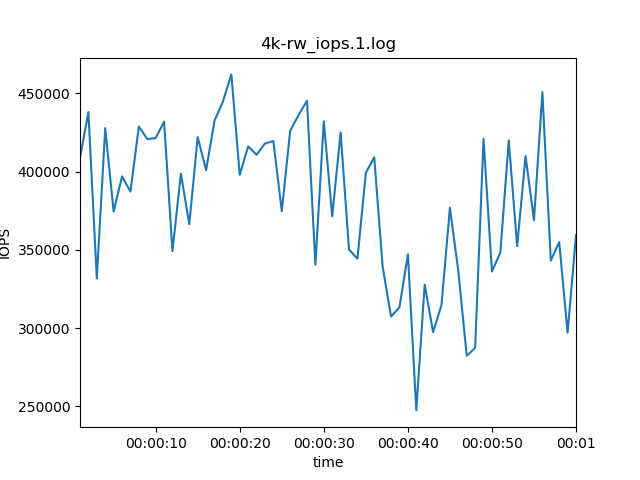
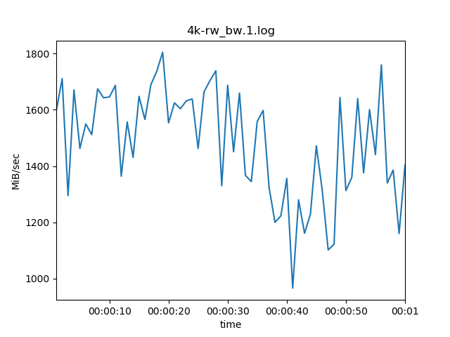
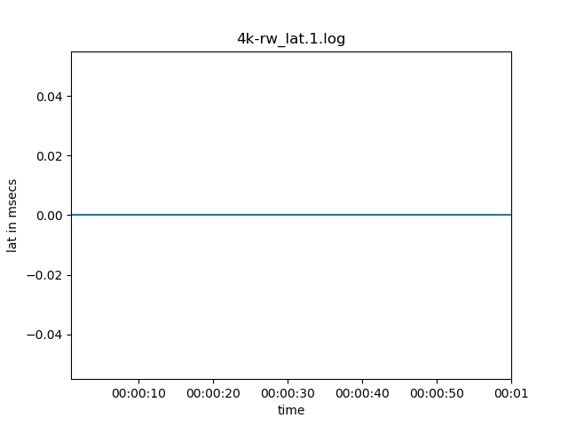
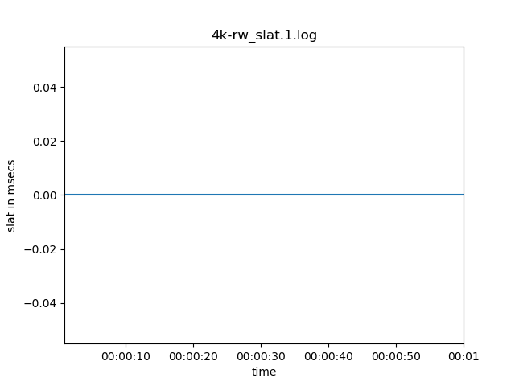
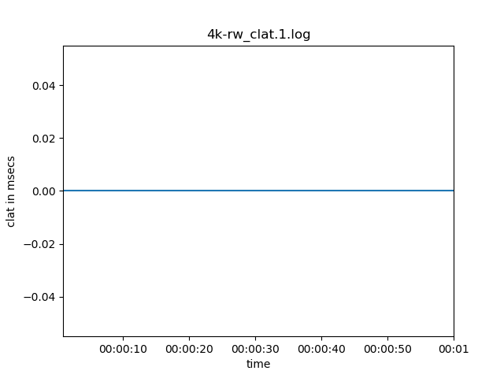

### fio configuration

```bash
write_bw_log
write_lat_log
write_iops_log
log_avg_msec=1000
```

### usage

```bash
$ ./fioplot.py -p 'examples/*.log' -o examples/
handling examples/4k-rw_lat.1.log..
handling examples/4k-rw_slat.1.log..
handling examples/4k-rw_iops.1.log..
handling examples/4k-rw_bw.1.log..
handling examples/4k-rw_clat.1.log..
```

### results





